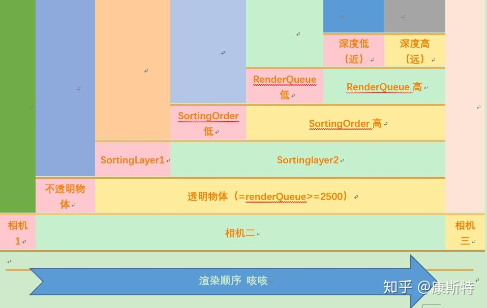

# Unity
---
- [Anchor 锚点详解](https://www.cnblogs.com/w-wfy/p/7800757.html)
- [URP 屏幕空间反射(SSR)](https://zhuanlan.zhihu.com/p/421005403)
- [模型到世界空间矩阵转换](https://blog.csdn.net/codingriver/article/details/83022752)
- [新手引导实现](https://cloud.tencent.com/developer/article/1802486) :&nbsp; 矩形镂空、事件渗透
  - [新手指引圆形和矩形挖洞](https://www.cnblogs.com/DonYao/p/11766527.html)
- [图解游戏引擎](http://www.luzexi.com/tag/%E5%9B%BE%E8%A7%A3%E6%B8%B8%E6%88%8F%E5%BC%95%E6%93%8E)
- [Unity渲染顺序总结](https://zhuanlan.zhihu.com/p/55762351)
  